# Costa Rica

This is my final project on Costa Rica 

project 1:
talk about the island that we couldn't get rid of
talk about the subdivisions
tlak about the city and provinces
san jose and how it gets more and more crowded there

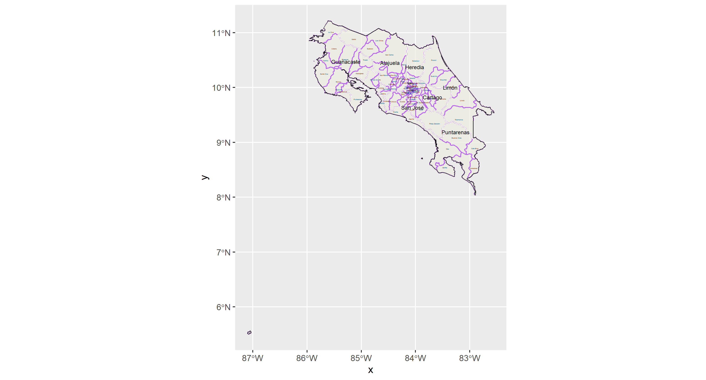
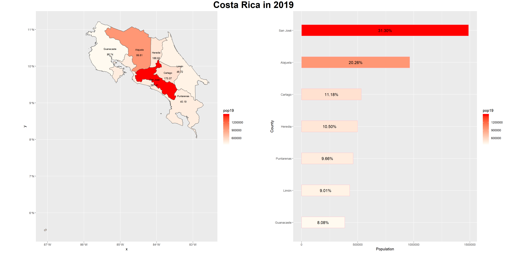
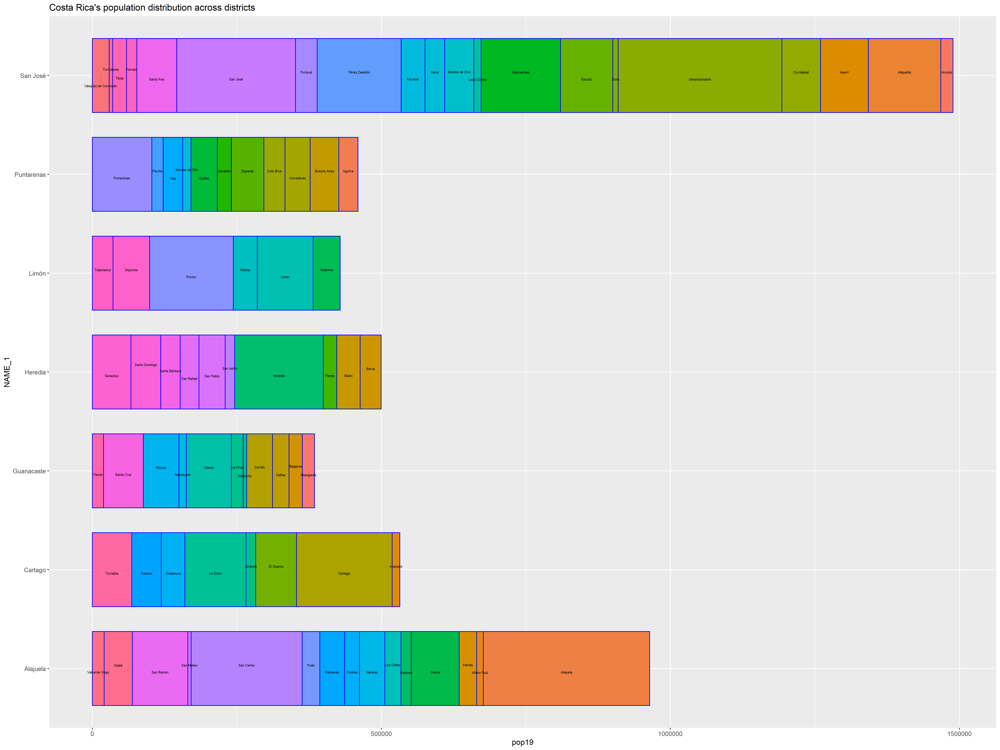
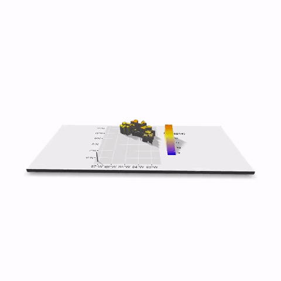

project 2:

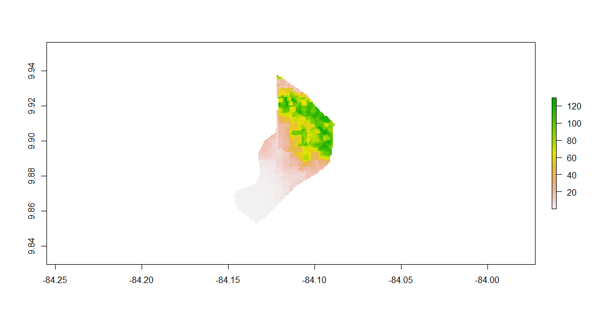
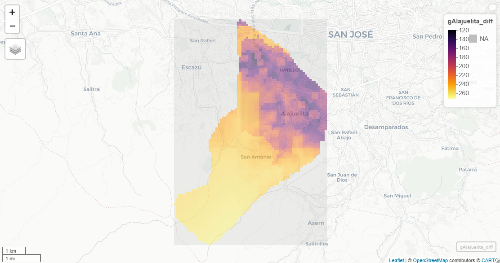
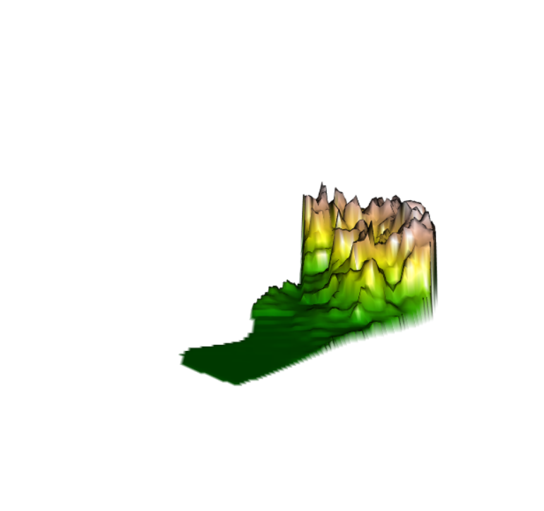
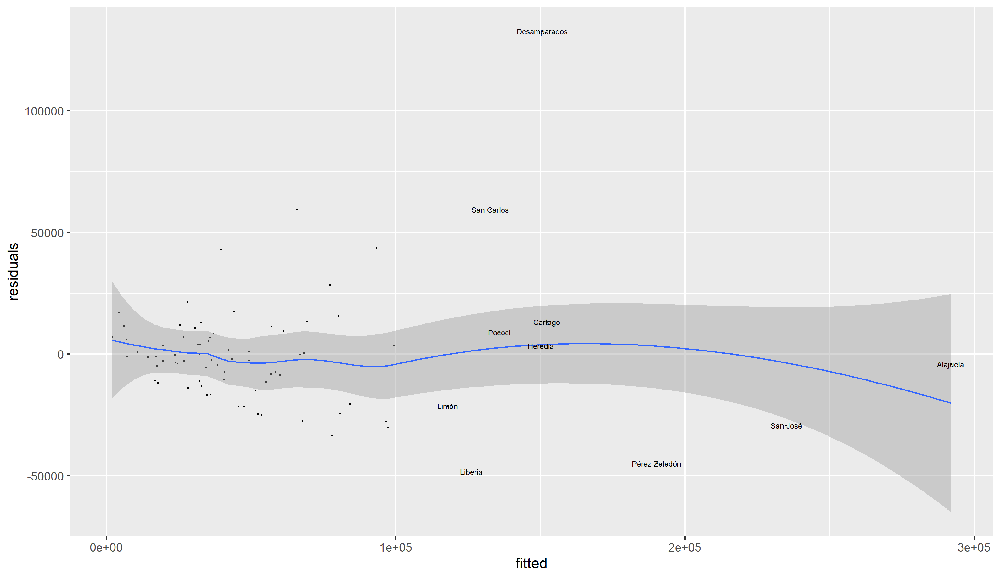

project 3:

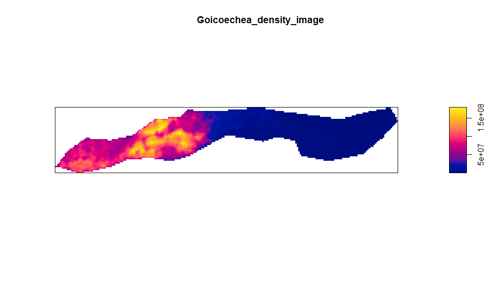
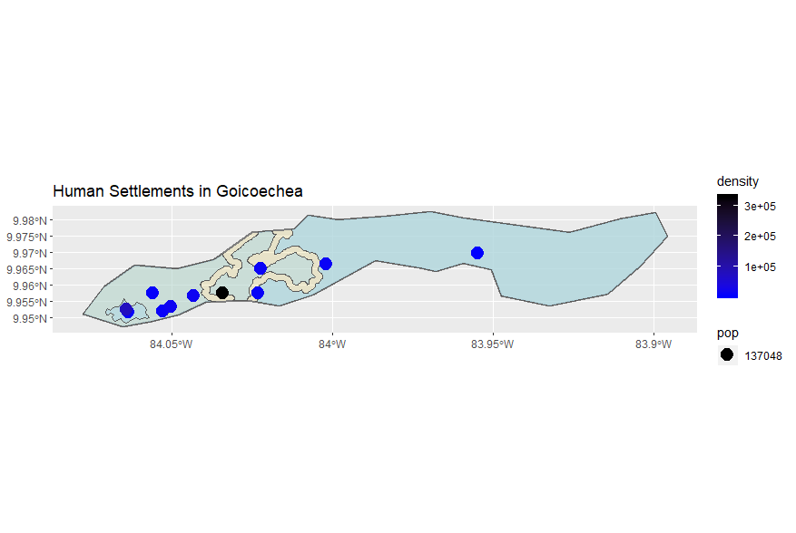
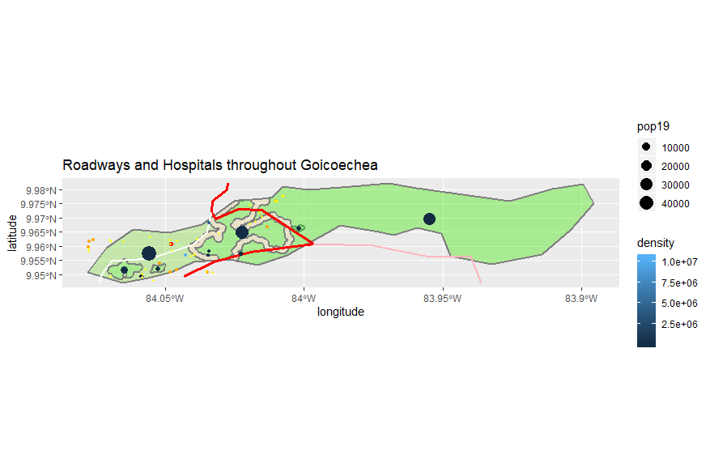

project 4:

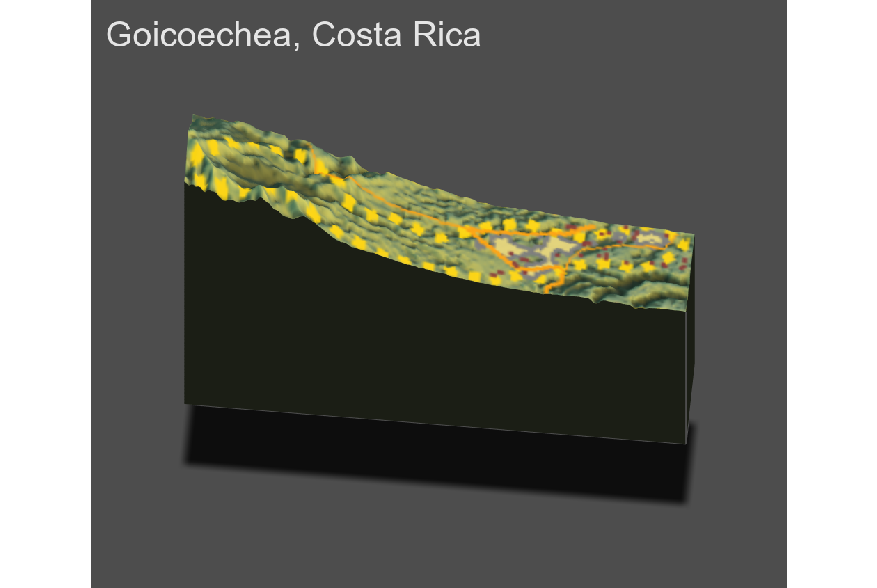

Incorporate the plots you have produced through the course of the semester, but also be sure to provide description, analysis and interpretation of the material as part of a comprehensive narrative.  Do not simply add everything you have produced, but instead strategically select the most relevant plots that support your written description, analysis and interpretation of the state of human development in the administrative subdivisions within your selected LMIC. 

Include in your final project deliverable individual sections that address the following. 

1. Describe the political subdivisions of your LMIC and selected administrative subdivisions.  Use a spatial description of the political subdivisions of your LMIC at the first, second and/or third administrative levels as appropriate and identify the location of your selected administrative subdivisions. Provide a detailed, spatial description of the political subdivided administrative areas you selected within your LMIC.  Increase the scale of these administrative areas to make details more readily interpretable.

2. Describe the population of your LMIC and selected administrative subdivisions.  Spatially describe the population distribution of your LMIC at the first, second and/or third administrative levels as appropriate.  Provide the results from your analysis of your LMIC's population including validation of the predicted spatial distribution of population values at different scales and your interpretation of relevant model results.  Include histograms, density plots, three-dimensional plots, overlays and other supplemental information as needed.  
3. Provide results from your description of human settlements, roadways and health care facilities.  Include supplemental tables that describe settlements, roadways and health care facilities as well as three-dimensional plots to further support your description, analysis, interpretation and findings.  Analyze and interpret your results in terms of the spatial distribution and size of human settlements, transportation facilities' level-of-service and health care services' accessibility.  Include relevants plots, tables and other supplemental information to support your analysis, interpretation and findings.  Assess the state of human development in the administrative subdivisions within your selected LMIC and state your finding.
