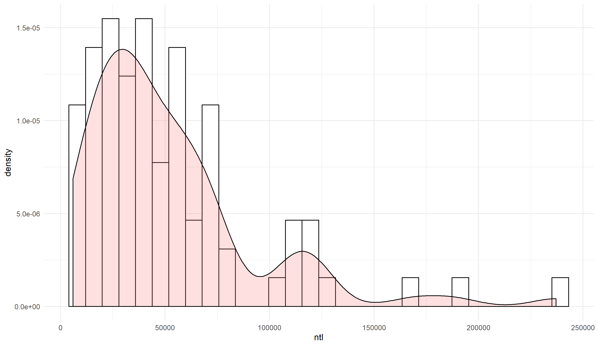
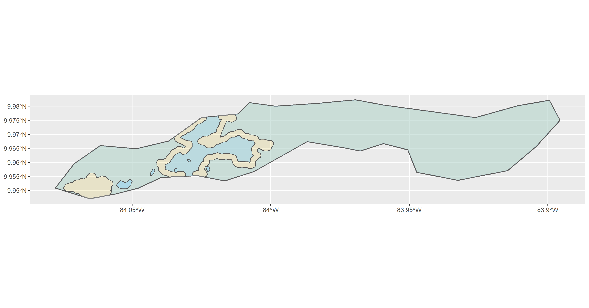
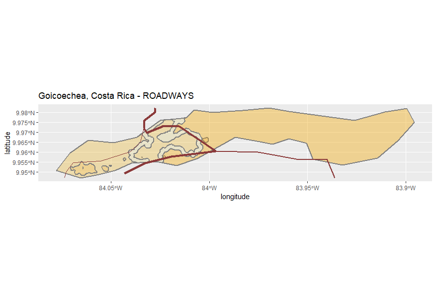
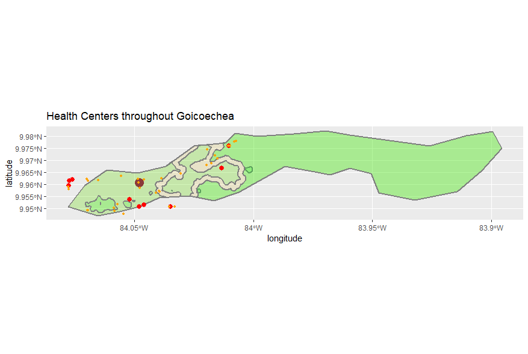
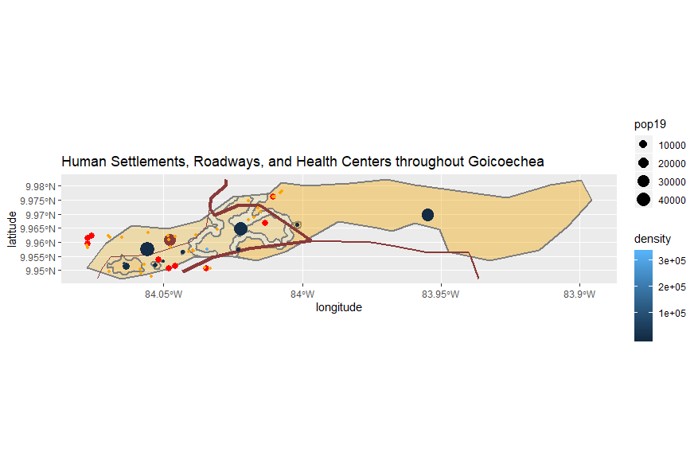

# Costa Rica
## by: Alyssa Nekritz
### Country: Costa Rica
### Administrative Subdivisions: Alajuelita and Goicoechea

## Administrative Divisions (#1)

### Administrtive Subdivisions of Costa Rica - Level 1

Costa Rica has 7 provinces, 82 cantons, and 478 districts. The first administrative subdivision breakdown is represented by the image below.
The darkest region, San Jose, is the most populated region. It's the capital of the country and the provice currently has 1,404,242 residents in a 4,966km^2 area. There's a high density there.

### Administrative Subdivisions of Costa Rica - Levels 1 & 2

The next image represents the breakdoen of the second administrative subdivision. The words are jumbled near the center of the country, by the capital, and that's where the urban population mostly resides. If you zoom into the picture, you get a clearer image of the cantons, like Ascota right above the San Jose lettering. Cocos Island, the tiny dot on the bottom left of the image is technically part of Costa Rica, so it's included in the image. If it was taken away, the subdivision imagery would be better.

### Population of Costa Rica's Provinces

This a chart and map demonstrating the densities of the subdivisions clearly. In descending order, the population percentages are shown based on the country's population data. There weren't that many gridcells, so I didn't need to subset an area like others did. The center of the country is the most populated and it gets less dense as you move outward. It has to deal with the topography of the areas. There are a lot of forested areas where the population densities are smaller.

### Population of Costa Rica's Cantons in a 3-D format (gif)

## Population Breakdown (#2)
**Populations:**
Costa Rica = 
Alajuelita (Alajuela) = 885,571 
Other Canton Populations:
San Jose  = 1,404,212

Cartago = 490,903

Guanacaste = 354,154

Heredia = 433,677

Limon = 386, 862

Puntarenas = 410, 929

**Population Analysis** 
### Predicted Values
  
I decided to choose the division Alajuelita, Costa Rica as the canton that I looked into deeper. The image above demonsrates the difference between the predicted value and the actual population value given. We needed to isolate a region that had both large and small populations in the same area.

### Density and Lights

This image uses a histogram to show the night time lights for each canton subdivision of Costa Rica and then combined it with the density plot. It's in descending order.

### Mapview Imagery
This shows the errors on a map viewpoint. 

### 3-D Spatial Values
This image is a 3-D representation of the spatial values for Alajuelita, Costa Rica.

### Regression Analysis
This regression analysis uses the population data and the night time lights values. as the predictors for the population of Costa Rica in 2019.

## Health Care Facilities, Urban Areas, and Roadways (#3)

### Population Points
The image below demonstrates the population points in the Goicoechea region. Each miniscule dot is supposed to represent a person so the darker the region the more populated the area was.

### Urban Areas
Then, we had to take the contour lines to represent different density levels and apply them to the graph. The image below represents the urban areas findings.

Then, density dots were added. Low = Red, High = Blue

### Density Image
Here's the final density image for the subdivision Goicoechea. The pinker areas are the higher densities

### Roadways
The thickest line is the primary route. The thinnest line is the tertiary route or the unknown. There isn't that much data about the roadways in Goicoechea.

ROADWAYS

| Primary | Secondary | Tertiary |
| ------- |:---------:| --------:|
|3        |1          |1         |

The following image shows the roadways throughout Goicoechea.

### Health Centers

HEALTH CARE FACILITIES

| Clinics | Hospitals | Dentist | Pharmacy | Doctors |
| ------- |:---------:|:-------:|:--------:| -------:|
|9        |1          |14       |18        |2        |

The image below contains the health centers. The dark red dot is the hospital, the orange dots are the densists, pharmacies, and doctors, and the red dots are the clinics

### Final Compiled Image
The image below overlays the roadways and the health centers onto the density distributed Goicoechea.

### Overlay
This was the final image that was overlayed to make the 3-D image.

### Final 3-D Product

