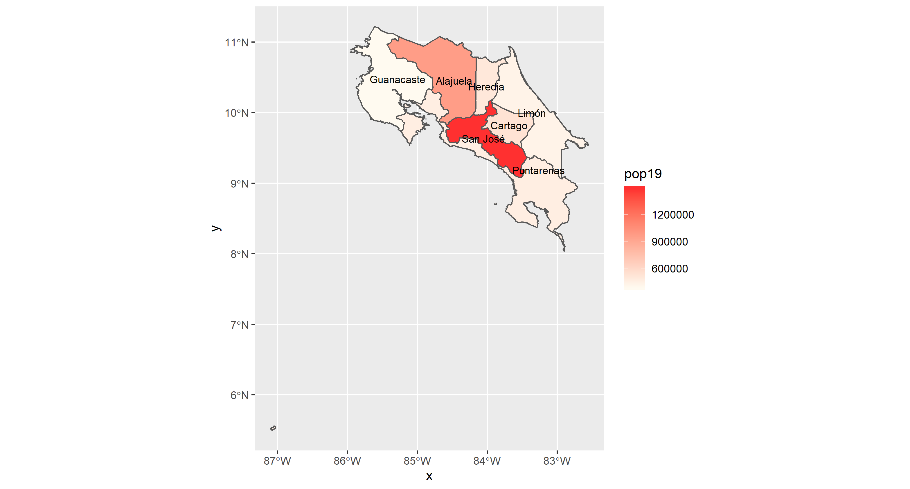

# Costa Rica
## Projects by: Alyssa Nekritz
### Country: Costa Rica
### Administrative Subdivisions: Alajuelita and Goicoechea

## Administrative Divisions (#1)
Costa Rica has 7 provinces, 82 cantons, and 478 districts. The first administrative subdivision breakdown is represented by the image below.
The darkest region, San Jose, is the most populated region. It's the capital of the country and the provice currently has 1,404,242 residents in a 4,966km^2 area. There's a high density there.
### Administrtive Subdivisions of Costa Rica - Level 1

The next image represents the breakdoen of the second administrative subdivision. The words are jumbled near the center of the country, by the capital, and that's where the urban population mostly resides. If you zoom into the picture, you get a clearer image of the cantons, like Ascota right above the San Jose lettering. Cocos Island, the tiny dot on the bottom left of the image is technically part of Costa Rica, so it's included in the image. If it was taken away, the subdivision imagery would be better.
### Administrative Subdivisions of Costa Rica - Levels 1 & 2

The following is a chart and map demonstrating the densities of the subdivisions clearly. In descending order, the population percentages are shown based on the country's population data. There weren't that many gridcells, so I didn't need to subset an area like others did. The center of the country is the most populated and it gets less dense as you move outward. It has to deal with the topography of the areas. There are a lot of forested areas where the population densities are smaller.
### Population of Costa Rica's Provinces

### Population of Costa Rica's Cantons in a 3-D format (gif)

## Population Breakdown (#2)
**Populations:**
Costa Rica = 
Alajuelita (Alajuela) = 885,571 
Other Canton Populations:
San Jose  = 1,404,212
Cartago = 490,903
Guanacaste = 354,154
Heredia = 433,677
Limon = 386, 862
Puntarenas = 410, 929

**Population Analysis**
Include histograms, density plots, three-dimensional plots, overlays and other supplemental information as needed. 
  
I decided to choose the division Alajuelita, Costa Rica as the canton that I looked into deeper. The image below demonsrates the difference between the predicted value and the actual population value given. We needed to isolate a region that had both large and small populations in the same area.

This regression analysis uses water data and dst011 as the predictors for the population of Costa Rica in 2019.

 
3. Provide results from your description of human settlements, roadways and health care facilities.  Include supplemental tables that describe settlements, roadways and health care facilities as well as three-dimensional plots to further support your description, analysis, interpretation and findings.  Analyze and interpret your results in terms of the spatial distribution and size of human settlements, transportation facilities' level-of-service and health care services' accessibility.  Include relevants plots, tables and other supplemental information to support your analysis, interpretation and findings.  Assess the state of human development in the administrative subdivisions within your selected LMIC and state your finding.

project 3:

project 4:

